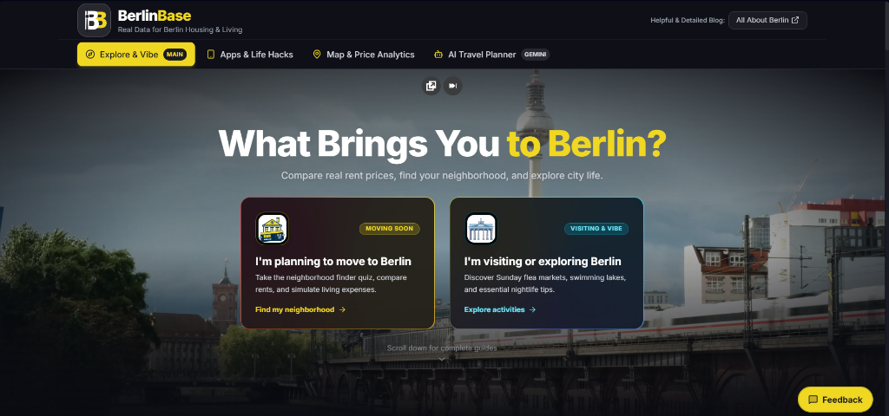

<div align="center">

# 🐻 BerlinBase
### Real Data for Berlin Housing, Relocation & Urban Lifestyle

[](https://berlinbase.vercel.app)
[](https://berlinbase.vercel.app)
[](#-privacy--zero-tracking)
[](LICENSE)

<br />

**An independent, non-commercial interactive guide built for everyone moving to, living in, or exploring Berlin.**  
Compare realistic rental costs, find your ideal neighborhood match, and navigate city life with zero clutter and zero sponsored fluff.

<br />

[](https://berlinbase.vercel.app)

<br />

[Live Demo](https://berlinbase.vercel.app) • [Why BerlinBase?](#-why-berlinbase) • [Our Stance on Bureaucracy & All About Berlin](#-bureaucracy-guides--all-about-berlin) • [Key Features](#-core-features) • [Local Setup](#-running-the-project-locally)

---

</div>

## 💡 Why BerlinBase?

Moving to Berlin is one of the most exciting decisions you can make, but navigating its housing reality can feel overwhelming:

- **The Housing Reality**: High competition for apartments, sudden listing expirations, and deposit scam traps.
- **The "Kaltmiete" Confusion**: Most portals only show base rent (*Kaltmiete*), leaving newcomers surprised when heating, building maintenance (*Warmmiete*), electricity, and internet add another 250–400€ to their monthly budget.
- **Finding Your Kiez**: Berlin is not just one city—it is a federation of distinct neighborhoods, each with its own energy, commute times, fiber internet coverage, and vibe.

**BerlinBase** is designed to give you a clear, honest, and visual perspective on what living in each district actually costs, how connected it is to central hubs, and which neighborhood genuinely matches your lifestyle.

---

## 🤝 Bureaucracy Guides & All About Berlin

> ### 💡 An Important Note on Legal & Visa Information
> If you are looking for step-by-step legal processes, visa applications, tax registration, and official German bureaucracy checklists, **we do not attempt to reinvent that wheel.**
> 
> The team at **[All About Berlin](https://allaboutberlin.com)** has created the single most thorough, trusted, and up-to-date guide to German bureaucracy in existence. Their articles cover everything from obtaining your *Anmeldung* and finding an English-speaking doctor to understanding your tax ID (*Steuer-ID*).
> 
> **How BerlinBase fits in:**  
> While *All About Berlin* is your definitive reading encyclopedia for German legal processes, **BerlinBase is your interactive visual workbench**:
> - Real-time **neighborhood matching** based on your lifestyle and habits.
> - An interactive **Leaflet map** showing 22 districts, transit travel times, and Ringbahn boundaries.
> - An **All-in Living Cost Calculator** factoring in real grocery habits and the official Deutschlandticket.
> - A curated **Travel & Itinerary Planner** that generates cluster-based day plans and exports directly to your calendar (.ics) or printable PDF.

---

## 🚀 Core Features

### 1. 🧭 Best Neighborhood for You (5-Step Match Quiz)
- Answer 5 quick questions about your monthly budget, transit preferences, evening vibes, and dining habits.
- Receive a personalized district recommendation complete with **honest Pros & Cons** (Altbau energy considerations, night noise levels, supermarket density, and Bürgeramt turnaround times).

### 2. 🗺️ Interactive District Map & Price Analytics
- **22 Berlin Districts Live**: Explore 12 central boroughs + 10 accessible outer districts (like Karlshorst, Tempelhof, Alt-Treptow, and Spandau).
- **Metric Slicers**: Switch between All-in Rent, Commute Minutes to Alexanderplatz/Hauptbahnhof, International Cuisine %, Fiber Internet coverage, and Specialty Coffee prices.
- **Transit Overlay**: Toggle the official S-Bahn Ringbahn (Zone A boundary) and key 24h weekend night lines (U1/U3 and U8).

### 3. 💰 Realistic Cost of Living Calculator
- Simulates your actual monthly balance based on your net salary.
- Compare living expenses across **WG Rooms**, **1-Room Studios (1+0)**, and **1-Bedroom Flats (1+1 / 1+2)**.
- Includes fixed utilities and official **Deutschlandticket** transit rates.

### 4. 📅 Smart Itinerary Planner & Travel Engine
- Plan multi-day Berlin trips with venues strictly grouped into geographic neighborhood clusters to minimize unnecessary commute times.
- **Rain Contingency Mode**: Automatically swaps open-air monuments and outdoor beer gardens for cozy indoor museums and covered taprooms.
- **Offline Sync**: One-click export to Apple/Google Calendar (`.ics`) and printable offline PDF dossiers.

### 5. 📱 Useful Apps & Local Life Hacks
- Curated recommendations for grocery saving (Too Good To Go), second-hand furniture logistics (Kleinanzeigen, Lalamove), money transfers (Wise), and electricity contract switching (Check24).

---

## 🎨 Design System: Inspired by BVG

BerlinBase takes its visual cues from the iconic design language of Berlin’s public transit network (**BVG**):

- 🟡 **BVG Yellow (`#F0D722`)**: Focal highlights, active modules, and key buttons.
- 🌑 **Deep Slate (`#1A1A24`)**: Dark, modern background that is easy on the eyes.
- 🏢 **Container Gray (`#2C2D35`)**: Elevated card surfaces and structural containers.
- ⚪ **High-Contrast Light (`#F8F9FA`)**: Crisp typography for effortless readability.
- 🔴 **U-Bahn Red (`#E30613`)**: Scam alerts and critical cautionary notices.

All interactive buttons and navigation tabs are designed with a minimum of **44×44px** touch area for smooth mobile usage.

---

## 🔒 Privacy & Zero Tracking

- **No Personal Data Collected**: BerlinBase does not ask for your name, email, or account registration.
- **Private by Default**: Your quiz answers and budget simulations exist solely in your browser session and disappear when you close the tab.
- **GDPR Compliant**: Zero invasive ad trackers, zero marketing cookies, zero commercial profiling.

---

## 💻 Running the Project Locally

If you'd like to run BerlinBase on your computer or explore the code:

### 1. Prerequisites
- [Node.js](https://nodejs.org/) (version 18 or higher recommended)
- `git` installed on your system

### 2. Quick Setup

```bash
# 1. Clone the repository
git clone https://github.com/your-username/berlinbase.git

# 2. Open the project folder
cd berlinbase

# 3. Install dependencies
npm install

# 4. Start the local development server
npm run dev
```

Open `http://localhost:5173` (or the port shown in your terminal) to view the app in your browser!

### 3. Build for Production

```bash
npm run build
```

The output files will be cleanly generated in the `dist/` directory.

---

## 📊 Data Sources & Transparency

BerlinBase is committed to transparent numbers:
- **Rent Figures**: Calculated as *Warmmiete* (Total monthly cost including heating, water advance, and building operations).
- **Public Transit Geometries**: Spatial coordinates and Ringbahn loop polygons referenced directly from VBB/BVG transit network data.
- **Registration Times**: Empirical wait averages for Bürgeramt slots across inner and outer districts.

---

## 🤝 Feedback & Contributions

Got an insider tip, a corrected späti hotspot, or an idea for a new feature?
- Submit feedback directly via the floating **Feedback button** in the app.
- Feel free to open an **Issue** or submit a **Pull Request** on this repository!

---

## ⚖️ Disclaimer

*BerlinBase is an independent, non-commercial community project. It is not affiliated with, endorsed by, or sponsored by Berliner Verkehrsbetriebe (BVG), the City of Berlin, or any real estate portal.*
